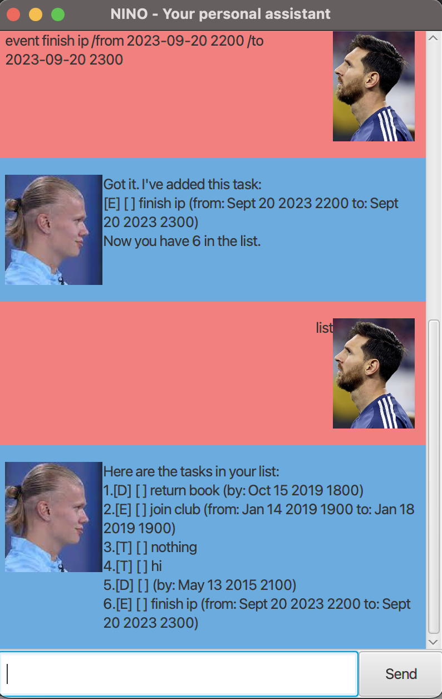

# User Guide for NINO
***NINO*** is an efficient chatbot assistant designed for streamlined task and note management. It is tailored for users who prefer Command Line Interface (CLI) interactions, making it particularly advantageous for those who are adept at typing quickly. At the same time, it provides the convenience of a Graphical User Interface (GUI).




## Features

### `todo` - Add a TODO task to tasks list

Format: `todo <description>`

Example: `todo Do ip tasks for the week`

Expected Outcome:
```
Got it. I've added this task:
[T][ ] Do ip tasks for the week
Now you have 1 tasks in the list 
```

###  `deadline` - Add a DEADLINE task to tasks list

Format: `deadline <description> /by <deadline in yyyy-mm-dd HHmm format>`

Example: `deadline Submit ip /by 2023-09-20 2359`

Expected Outcome:
```
Got it. I've added this task:
[D][ ] Submit ip (by: Sep 20 2023 2359)
Now you have 2 tasks in the list.
```

### `event` - Add an EVENT task to tasks list

Format: `event <description> /from <start_date in yyyy-mm-dd HHmm format> /to <start_date in yyyy-mm-dd HHmm format>`

Example: `event CS2103T tutorial /from 2023-09-21 0800 /to 2023-09-21 0900`

Expected Outcome:
```
Got it. I've added this task:
[E][ ] CS2103T tutorial (from: Sep 21 2023 0800 to: Sep 21 2023 0800)
Now you have 3 tasks in the list.
```

### `list` - Lists all the tasks in the tasks list.

Format: `list`

Example: `list`

Expected Outcome:
```
Here are the tasks in your list:
1.[T] [] Do ip tasks for the week
2.[D] [] Submit ip (by: Sep 20 2023 2359)
3.[E] [] CS2103T tutorial (from: Sep 21 2023 0800 to: Sep 21 2023 0800)
```

### `mark` - Marks the unmarked task at the index in the tasks list as done.

Format: `mark <index>`

Example: `mark 1`

```
Nice! I've marked this task as done:
[T] [X] Do ip tasks for the week
```

### `unmark`- Unmarks the marked task at the index in the tasks list as not done yet.

Format: `unmark <index>`

Example: `unmark 1`

```
OK! I've marked this task as not done yet:
[T] [] Do ip tasks for the week
```

### `delete` - Deletes a task at that index from the tasks list.

Format: `delete <index>`

Example: `delete 1`

```
Noted! I've removed this task:
[T] [] Do ip tasks for the week
Now you have 2 tasks in the list.
```

### `find` - Finds all task that matches the target in the tasks list.

Format: `find <description>`

Example: `find ip`

Expected Outcome:

```  
Here are the matching tasks in your list;
1. [D] [] Submit ip (by: Sep 20 2023 2359)
```

### `bye` - Exits the program.

Format: `bye`

Example: `bye`

Expected Outcome: 

The application window will close

